# ?? Documento de Validación y QA
## Módulo de Gestión de Trabajadores

---

| **Campo** | **Valor** |
|-----------|-----------|
| **Proyecto** | TrabajadoresPrueba |
| **Autor** | Diego Alessandro Cardenas Garcia |
| **Fecha** | Junio 2025 |
| **Versión** | 1.0 |
| **Tecnología** | .NET 8 / Blazor / Entity Framework Core |

---

## ?? Índice

1. [Introducción](#1-introducción)
2. [Alcance de las Pruebas](#2-alcance-de-las-pruebas)
3. [Casos de Prueba Funcionales](#3-casos-de-prueba-funcionales)
4. [Pruebas Unitarias](#4-pruebas-unitarias)
5. [Pruebas de Integración](#5-pruebas-de-integración)
6. [Resumen de Resultados](#6-resumen-de-resultados)
7. [Evidencias Visuales](#7-evidencias-visuales)
8. [Conclusiones](#8-conclusiones)

---

## 1. Introducción

El presente documento tiene como objetivo documentar todas las pruebas realizadas al **Módulo de Gestión de Trabajadores**, desarrollado como parte de la prueba técnica para el cargo de Analista Programador .NET en MYPER Software.

El módulo permite realizar las operaciones CRUD (Crear, Leer, Actualizar, Eliminar) sobre registros de trabajadores, incluyendo funcionalidades adicionales como filtrado por sexo y coloreo de filas.

### 1.1 Objetivos de las Pruebas

- Verificar que todas las funcionalidades cumplan con los requerimientos especificados
- Validar el correcto funcionamiento de las operaciones CRUD
- Asegurar que las validaciones de datos funcionen correctamente
- Comprobar la integridad de datos en la base de datos
- Garantizar la correcta integración entre el frontend (Blazor) y el backend (API)

### 1.2 Herramientas Utilizadas

| Herramienta | Propósito |
|-------------|-----------|
| xUnit | Framework para pruebas unitarias e integración |
| FluentAssertions | Assertions legibles y descriptivas |
| Moq | Mocking de dependencias |
| WebApplicationFactory | Pruebas de integración con servidor de prueba |
| SQL Server | Base de datos TrabajadoresPrueba |

---

## 2. Alcance de las Pruebas

### 2.1 Funcionalidades Cubiertas

| Funcionalidad | Descripción | Cubierto |
|---------------|-------------|----------|
| Listado de trabajadores | Visualizar todos los trabajadores registrados | ? |
| Registro de trabajador | Crear nuevo trabajador con todos sus datos | ? |
| Edición de trabajador | Modificar datos de un trabajador existente | ? |
| Eliminación de trabajador | Eliminar registro con confirmación | ? |
| Filtro por sexo | Filtrar lista por Masculino/Femenino | ? |
| Coloreo de filas | Azul para masculino, naranja para femenino | ? |
| Validaciones | Campos requeridos, documento único, formatos | ? |
| Subida de foto | Cargar imagen del trabajador | ? |

### 2.2 Tipos de Pruebas Realizadas

1. **Pruebas Funcionales**: Verificación manual de cada funcionalidad desde la interfaz
2. **Pruebas Unitarias**: Tests automatizados para servicios y controladores
3. **Pruebas de Integración**: Tests automatizados del flujo completo API ? Base de datos

---

## 3. Casos de Prueba Funcionales

A continuación se documentan los casos de prueba funcionales realizados sobre el módulo. Cada caso incluye los datos de entrada, los pasos ejecutados, el resultado esperado y el resultado obtenido.

---

### 3.1 Listado de Trabajadores

#### Caso 001: Visualización de lista de trabajadores

| Campo | Descripción |
|-------|-------------|
| **Nombre** | Visualización de lista de trabajadores |
| **Módulo** | Listado |
| **Prioridad** | Alta |
| **Precondiciones** | Existen trabajadores registrados en la base de datos |

**Datos de Entrada:** N/A (Consulta automática al cargar la página)

**Pasos:**
1. Acceder a la URL del módulo de trabajadores
2. Esperar a que cargue la página completamente
3. Observar la tabla de trabajadores

**Resultado Esperado:**
- La página carga sin errores
- Se muestra una tabla con todos los trabajadores registrados
- Cada fila muestra: foto, nombres, apellidos, tipo documento, número documento, sexo, fecha nacimiento, dirección
- Las filas están coloreadas según el sexo (azul/naranja)

**Resultado Obtenido:** ? PASÓ
> La lista de trabajadores se carga correctamente mostrando todos los campos. Las filas se colorean correctamente: azul para masculino y naranja para femenino.

**Evidencias:**

| Captura | Descripción |
|---------|-------------|
| 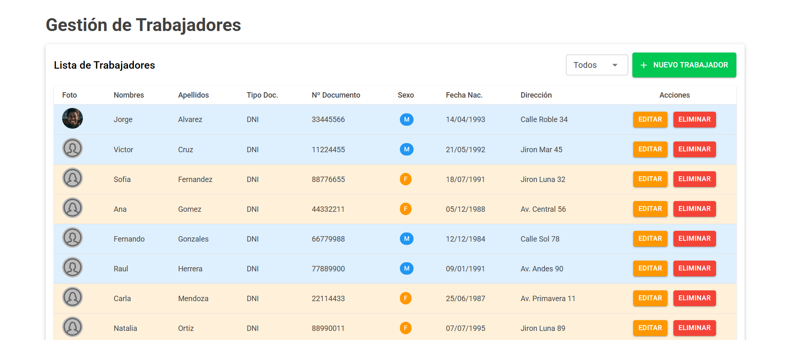 | Vista del listado de trabajadores en la aplicación web Blazor, mostrando la tabla con todos los registros, coloreo de filas por sexo y los datos completos de cada trabajador. |
| 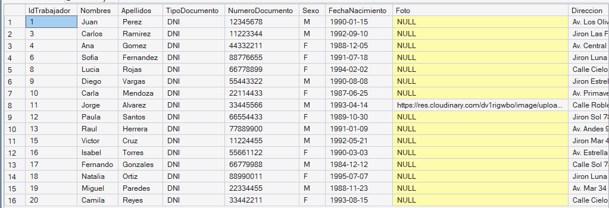 | Consulta SELECT TOP 1000 ejecutada en SQL Server Management Studio sobre la tabla Trabajadores, verificando que los datos mostrados en la web coinciden exactamente con los registros almacenados en la base de datos. |

---

#### Caso 002: Lista vacía cuando no hay registros

| Campo | Descripción |
|-------|-------------|
| **Nombre** | Lista vacía cuando no hay registros |
| **Módulo** | Listado |
| **Prioridad** | Media |
| **Precondiciones** | Base de datos sin registros de trabajadores |

**Datos de Entrada:** N/A

**Pasos:**
1. Eliminar todos los registros de la base de datos (o usar BD vacía)
2. Acceder al módulo de trabajadores
3. Observar el contenido de la tabla

**Resultado Esperado:**
- La tabla se muestra vacía con un mensaje "No hay trabajadores registrados"
- No se muestran errores

**Resultado Obtenido:** ? PASÓ
> El sistema maneja correctamente el escenario sin datos, mostrando el mensaje de no tener trabajadores en la interfaz.

**Evidencias:**

| Captura | Descripción |
|---------|-------------|
| 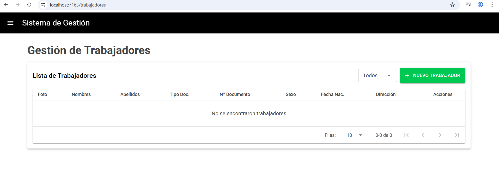 | Vista del listado de trabajadores en la aplicación web Blazor cuando no existen registros, mostrando el mensaje "Sin datos" indicando que la tabla está vacía. |
| 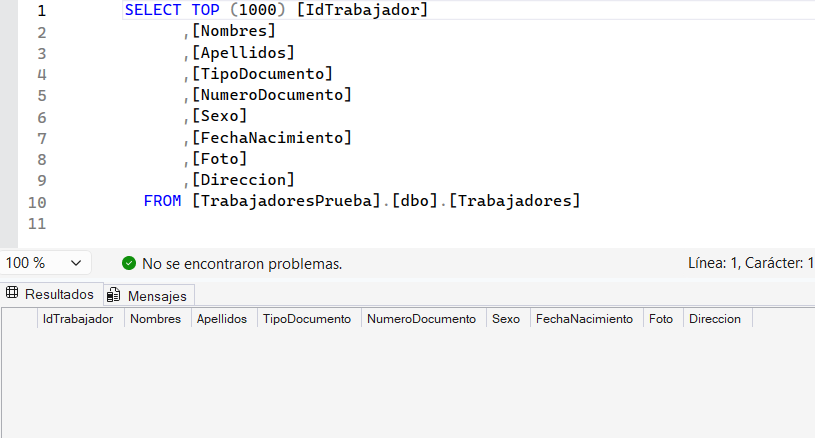 | Consulta SELECT ejecutada en SQL Server Management Studio sobre la tabla Trabajadores, confirmando que no existen registros en la base de datos. |

---

#### Caso 003: Filtro por sexo - Masculino

| Campo | Descripción |
|-------|-------------|
| **Nombre** | Filtro por sexo - Masculino |
| **Módulo** | Listado |
| **Prioridad** | Media |
| **Precondiciones** | Existen trabajadores de ambos sexos registrados |

**Datos de Entrada:** Selección de filtro "Masculino"

**Pasos:**
1. Acceder al módulo de trabajadores
2. Ubicar el filtro por sexo
3. Seleccionar la opción "Masculino"
4. Observar la tabla filtrada

**Resultado Esperado:**
- Solo se muestran trabajadores con sexo Masculino
- Todas las filas visibles son de color azul
- El contador de registros se actualiza

**Resultado Obtenido:** ? PASÓ
> El filtro funciona correctamente, mostrando únicamente los trabajadores masculinos con las filas en color azul.

**Evidencias:**

| Captura | Descripción |
|---------|-------------|
| 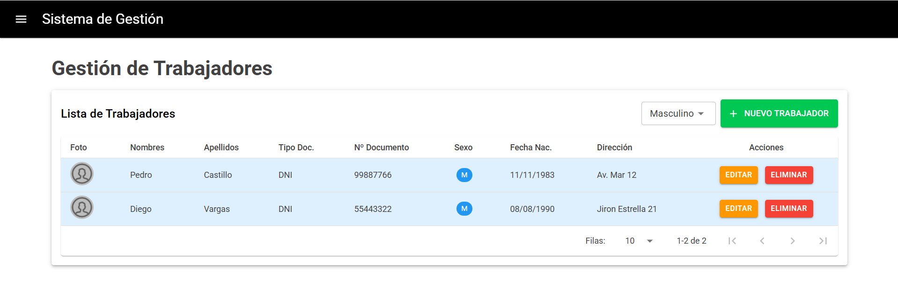 | Vista del listado de trabajadores en la aplicación web Blazor con el filtro "Masculino" aplicado, mostrando únicamente los trabajadores de sexo masculino con todas las filas en color azul. |
|  | Consulta SELECT ejecutada en SQL Server Management Studio mostrando TODOS los registros de la tabla Trabajadores (masculinos y femeninos), demostrando que el filtrado se realiza correctamente en la aplicación web mientras la base de datos mantiene todos los datos. |

---

#### Caso 004: Filtro por sexo - Femenino

| Campo | Descripción |
|-------|-------------|
| **Nombre** | Filtro por sexo - Femenino |
| **Módulo** | Listado |
| **Prioridad** | Media |
| **Precondiciones** | Existen trabajadores de ambos sexos registrados |

**Datos de Entrada:** Selección de filtro "Femenino"

**Pasos:**
1. Acceder al módulo de trabajadores
2. Ubicar el filtro por sexo
3. Seleccionar la opción "Femenino"
4. Observar la tabla filtrada

**Resultado Esperado:**
- Solo se muestran trabajadores con sexo Femenino
- Todas las filas visibles son de color naranja
- El contador de registros se actualiza

**Resultado Obtenido:** ? PASÓ
> El filtro funciona correctamente, mostrando únicamente los trabajadores femeninos con las filas en color naranja.

**Evidencias:**

| Captura | Descripción |
|---------|-------------|
| 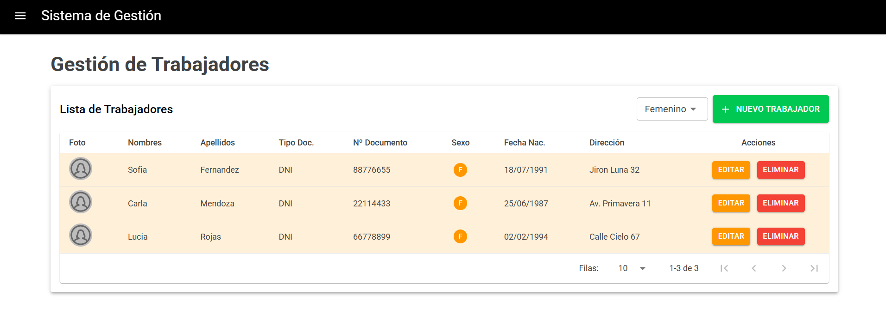 | Vista del listado de trabajadores en la aplicación web Blazor con el filtro "Femenino" aplicado, mostrando únicamente los trabajadores de sexo femenino con todas las filas en color naranja. |
| 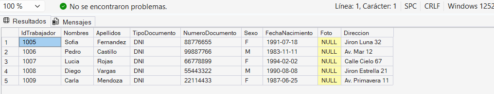 | Consulta SELECT ejecutada en SQL Server Management Studio mostrando TODOS los registros de la tabla Trabajadores (masculinos y femeninos), demostrando que el filtrado se realiza correctamente en la aplicación web mientras la base de datos mantiene todos los datos. |

---

#### Caso 005: Coloreo de filas según sexo

| Campo | Descripción |
|-------|-------------|
| **Nombre** | Coloreo de filas según sexo |
| **Módulo** | Listado |
| **Prioridad** | Baja (Bonus) |
| **Precondiciones** | Existen trabajadores de ambos sexos |

**Datos de Entrada:** N/A

**Pasos:**
1. Acceder al módulo de trabajadores
2. Observar el color de fondo de cada fila
3. Verificar que corresponda con el sexo del trabajador

**Resultado Esperado:**
- Filas de trabajadores masculinos: fondo azul claro
- Filas de trabajadores femeninos: fondo naranja claro

**Resultado Obtenido:** ? PASÓ
> El coloreo se aplica correctamente diferenciando visualmente a los trabajadores por sexo.

**Evidencias:**

| Captura | Descripción |
|---------|-------------|
| 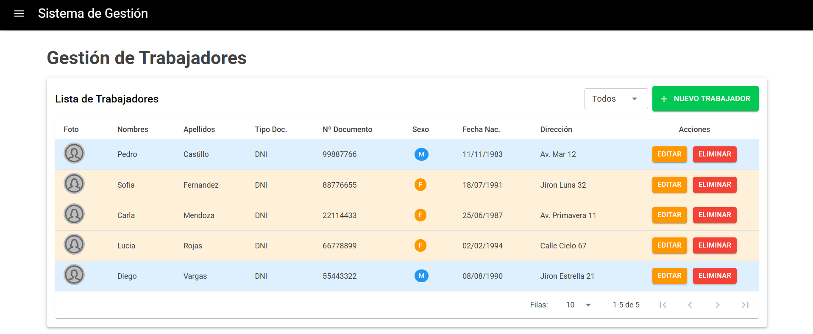 | Vista del listado de trabajadores en la aplicación web Blazor mostrando el coloreo correcto de filas: azul claro para trabajadores masculinos y naranja claro para trabajadores femeninos, verificando el funcionamiento del bonus de coloreo por sexo. |
|  | Consulta SELECT ejecutada en SQL Server Management Studio mostrando todos los registros de la tabla Trabajadores con el campo Sexo visible, confirmando la correspondencia entre los datos almacenados y el coloreo aplicado en la interfaz web. |

---

### 3.2 Registro de Trabajadores

#### Caso 006: Registro exitoso con todos los campos

| Campo | Descripción |
|-------|-------------|
| **Nombre** | Registro exitoso con todos los campos |
| **Módulo** | Registro |
| **Prioridad** | Alta |
| **Precondiciones** | Usuario en pantalla principal del módulo |

**Datos de Entrada:**

| Campo | Valor |
|-------|-------|
| Nombres | María Elena |
| Apellidos | García López |
| Tipo Documento | DNI |
| Número Documento | 87654321 |
| Sexo | Femenino |
| Fecha Nacimiento | 22/05/1995 |
| Foto | perfil_maria.jpg |
| Dirección | Av. Los Pinos 456 |

**Pasos:**
1. Hacer clic en el botón "Nuevo Trabajador"
2. Esperar a que se abra el modal de registro
3. Completar el campo "Nombres" con "María Elena"
4. Completar el campo "Apellidos" con "García López"
5. Seleccionar "DNI" en Tipo de Documento
6. Ingresar "87654321" en Número de Documento
7. Seleccionar "Femenino" en Sexo
8. Seleccionar fecha "22/05/1995" en Fecha de Nacimiento
9. Hacer clic en "Seleccionar foto" y elegir imagen
10. Ingresar dirección "Av. Los Pinos 456"
11. Hacer clic en botón "Guardar"

**Resultado Esperado:**
- El modal se cierra automáticamente
- Aparece notificación de éxito "Trabajador registrado correctamente"
- El nuevo registro aparece en la tabla
- La fila del nuevo registro es de color naranja (femenino)
- La foto se visualiza correctamente

**Resultado Obtenido:** ? PASÓ
> El trabajador se registró exitosamente. El modal se cerró, apareció la notificación de confirmación en la esquina superior derecha y el nuevo registro se visualiza correctamente en la base de datos.

**Evidencias:**

| Captura | Descripción |
|---------|-------------|
| 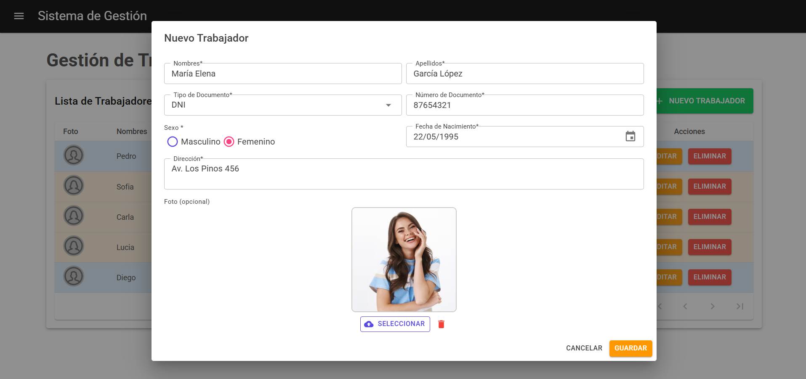 | Modal de registro de nuevo trabajador con todos los campos completados: nombres, apellidos, tipo documento, número documento, sexo, fecha de nacimiento, foto y dirección, listo para guardar. |
| 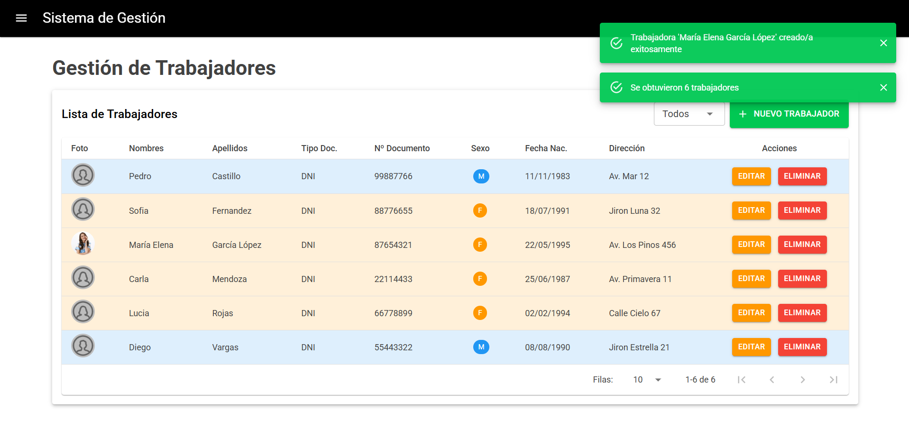 | Notificación toast en la esquina superior derecha de la pantalla indicando que el trabajador fue creado exitosamente, confirmando la operación de registro. |
| 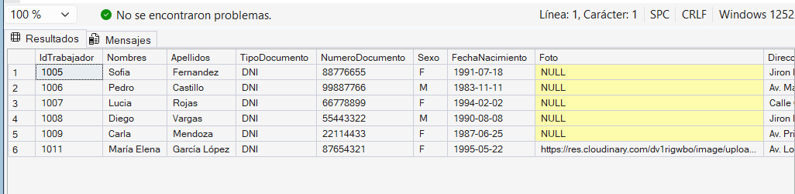 | Consulta SELECT ejecutada en SQL Server Management Studio mostrando el nuevo registro del trabajador creado, verificando que los datos fueron almacenados correctamente en la base de datos. |

---

#### Caso 007: Validación de campos requeridos vacíos

| Campo | Descripción |
|-------|-------------|
| **Nombre** | Validación de campos requeridos vacíos |
| **Módulo** | Registro |
| **Prioridad** | Alta |
| **Precondiciones** | Modal de registro abierto |

**Datos de Entrada:** Todos los campos vacíos

**Pasos:**
1. Abrir modal de registro de nuevo trabajador
2. No completar ningún campo
3. Hacer clic en el botón "Guardar"

**Resultado Esperado:**
- El formulario NO se envía
- Se muestran mensajes de validación en cada campo requerido:
  - "El nombre es requerido"
  - "Los apellidos son requeridos"
  - "El tipo de documento es requerido"
  - "El número de documento es requerido"
  - "El sexo es requerido"
  - "La fecha de nacimiento es requerida"
  - "La dirección es requerida"

**Resultado Obtenido:** ? PASÓ
> El sistema muestra correctamente los mensajes de validación para cada campo requerido, impidiendo el envío del formulario.

**Evidencias:**

| Captura | Descripción |
|---------|-------------|
| 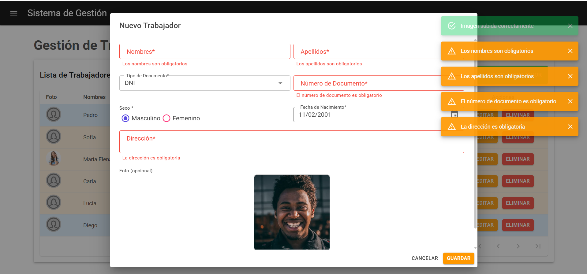 | Modal de registro mostrando los mensajes de validación en rojo para cada campo requerido que no fue completado, verificando que el sistema impide el envío del formulario con campos vacíos. |

---

#### Caso 008: Validación de número de documento duplicado

| Campo | Descripción |
|-------|-------------|
| **Nombre** | Validación de número de documento duplicado |
| **Módulo** | Registro |
| **Prioridad** | Alta |
| **Precondiciones** | Existe un trabajador con documento "87654321" |

**Datos de Entrada:**

| Campo | Valor |
|-------|-------|
| Nombres | Juan |
| Apellidos | Pérez |
| Tipo Documento | DNI |
| Número Documento | 87654321 (duplicado) |
| Sexo | Masculino |
| Fecha Nacimiento | 15/03/1990 |
| Dirección | Calle Test 123 |

**Pasos:**
1. Abrir modal de registro
2. Completar todos los campos
3. En "Número de Documento" ingresar uno que ya existe: "12345678"
4. Hacer clic en "Guardar"

**Resultado Esperado:**
- El registro NO se crea
- Se muestra mensaje de error: "Ya existe un trabajador con este número de documento"

**Resultado Obtenido:** ? PASÓ
> El sistema detecta el documento duplicado y muestra la advertencia correspondiente, impidiendo la creación del registro.

**Evidencias:**

| Captura | Descripción |
|---------|-------------|
| 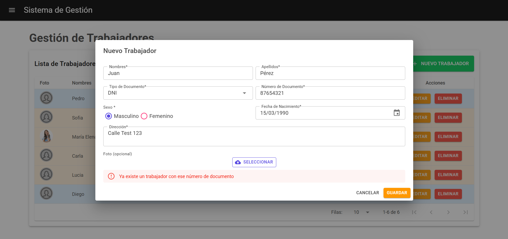 | Advertencia mostrada al intentar registrar un trabajador con un número de documento que ya existe en el sistema, indicando que no se permite duplicar documentos. |

---

#### Caso 009: Registro sin foto (campo opcional)

| Campo | Descripción |
|-------|-------------|
| **Nombre** | Registro sin foto (campo opcional) |
| **Módulo** | Registro |
| **Prioridad** | Media |
| **Precondiciones** | Usuario en pantalla de registro |

**Datos de Entrada:** Todos los campos completos excepto foto

**Pasos:**
1. Abrir modal de registro
2. Completar todos los campos obligatorios
3. NO seleccionar foto
4. Hacer clic en "Guardar"

**Resultado Esperado:**
- El registro se crea exitosamente
- El trabajador aparece en la lista con una imagen por defecto o placeholder

**Resultado Obtenido:** ? PASÓ
> El sistema permite crear trabajadores sin foto, mostrando un avatar por defecto en la tabla.

**Evidencias:**

| Captura | Descripción |
|---------|-------------|
|  | Modal de registro de nuevo trabajador con todos los campos obligatorios completados pero sin seleccionar una foto, demostrando que el campo de imagen es opcional. |
|  | Vista del listado de trabajadores mostrando el registro creado sin foto, donde se visualiza un avatar o imagen por defecto en lugar de la fotografía del trabajador. |

---

### 3.3 Edición de Trabajadores

#### Caso 010: Edición exitosa de trabajador

| Campo | Descripción |
|-------|-------------|
| **Nombre** | Edición exitosa de trabajador |
| **Módulo** | Edición |
| **Prioridad** | Alta |
| **Precondiciones** | Existe al menos un trabajador registrado |

**Datos de Entrada:**

| Campo | Valor Original | Valor Modificado |
|-------|----------------|------------------|
| Dirección | Calle Original 123 | Av. Nueva 456 |

**Pasos:**
1. En la tabla de trabajadores, ubicar el registro a editar
2. Hacer clic en el botón "Editar" (ícono lápiz)
3. Esperar que se abra el modal con los datos cargados
4. Verificar que todos los campos muestren los datos actuales
5. Modificar el campo "Dirección" a "Av. Nueva 456"
6. Hacer clic en "Guardar"

**Resultado Esperado:**
- El modal se cierra
- Aparece mensaje "Trabajador actualizado correctamente"
- La tabla se actualiza mostrando el nuevo valor de dirección

**Resultado Obtenido:** ? PASÓ
> Los datos se actualizaron correctamente. El modal se cerró, se mostró el mensaje de éxito y la tabla refleja los cambios realizados.

**Evidencias:**

| Captura | Descripción |
|---------|-------------|
| 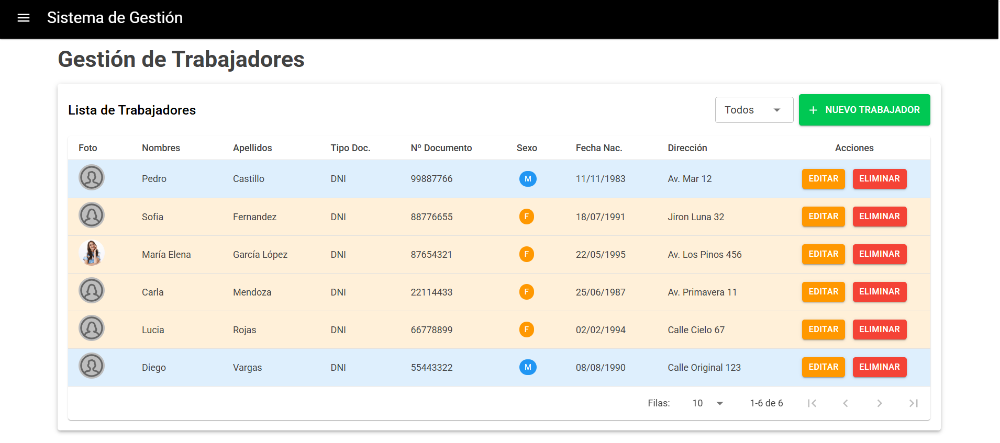 | Vista del listado de trabajadores mostrando el registro original antes de la edición, con los datos que serán modificados. |
| 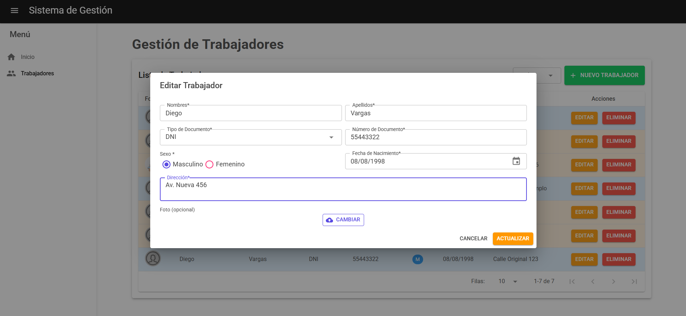 | Modal de edición del trabajador con los campos cargados y la modificación realizada en el campo Dirección, listo para guardar los cambios. |
| 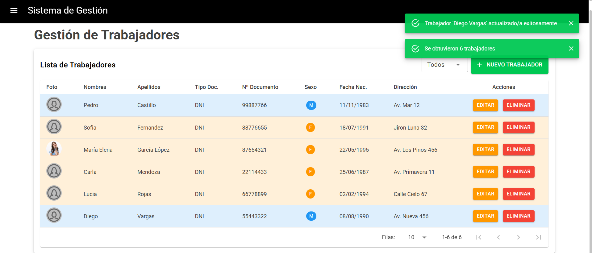 | Vista del listado de trabajadores mostrando el registro actualizado después de la edición, verificando que los cambios se reflejan correctamente en la tabla. |

---

#### Caso 011: Cancelar edición sin guardar cambios

| Campo | Descripción |
|-------|-------------|
| **Nombre** | Cancelar edición sin guardar cambios |
| **Módulo** | Edición |
| **Prioridad** | Media |
| **Precondiciones** | Existe trabajador registrado |

**Datos de Entrada:** Modificaciones que no se guardarán

**Pasos:**
1. Hacer clic en "Editar" de un trabajador
2. Modificar algunos campos
3. Hacer clic en "Cancelar" o cerrar el modal (X)
4. Verificar los datos en la tabla

**Resultado Esperado:**
- El modal se cierra sin guardar
- Los datos originales permanecen sin cambios

**Resultado Obtenido:** ? PASÓ
> Al cancelar la edición, los datos originales se mantienen intactos. La dirección modificada en el modal no se guardó y la tabla muestra los valores originales.

**Evidencias:**

| Captura | Descripción |
|---------|-------------|
| 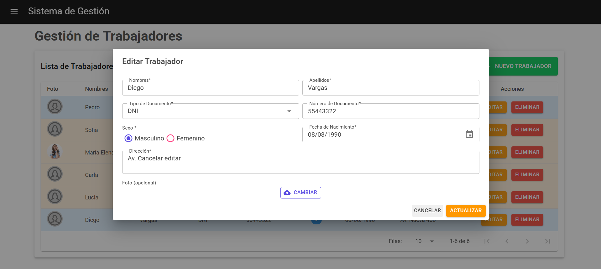 | Modal de edición del trabajador Diego Vargas con una dirección de prueba modificada ("prueba para cancelar"), antes de hacer clic en el botón Cancelar. |
| 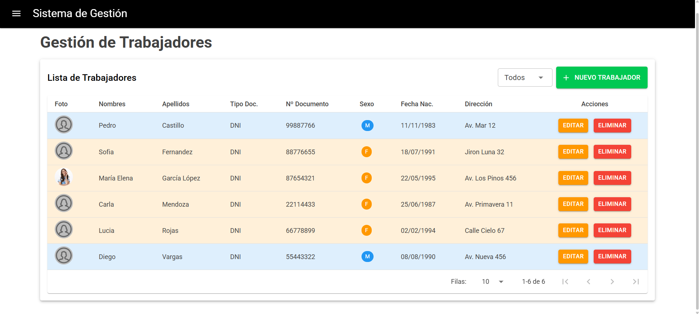 | Vista del listado de trabajadores después de cancelar la edición, verificando que los datos originales del trabajador Diego Vargas permanecen sin cambios en la tabla. |

---

#### Caso 012: Edición con documento duplicado

| Campo | Descripción |
|-------|-------------|
| **Nombre** | Edición con documento duplicado |
| **Módulo** | Edición |
| **Prioridad** | Alta |
| **Precondiciones** | Existen dos trabajadores con documentos diferentes |

**Datos de Entrada:** Cambiar el número de documento a uno que ya existe en otro registro

**Pasos:**
1. Editar un trabajador
2. Cambiar el número de documento por uno existente en otro registro
3. Intentar guardar

**Resultado Esperado:**
- El sistema impide la actualización
- Muestra mensaje: "Ya existe un trabajador con este número de documento"

**Resultado Obtenido:** ? PASÓ
> El sistema valida correctamente que no se dupliquen números de documento entre trabajadores diferentes.

**Evidencias:**

| Captura | Descripción |
|---------|-------------|
| 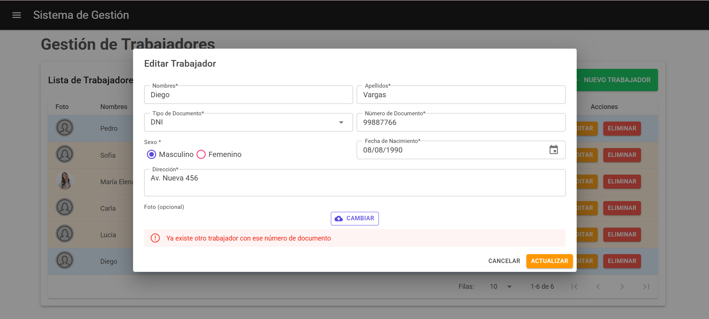 | Advertencia mostrada al intentar actualizar un trabajador con un número de documento que ya existe en otro registro, indicando que no se permite duplicar documentos durante la edición. |

---

### 3.4 Eliminación de Trabajadores

#### Caso 013: Eliminación con confirmación afirmativa

| Campo | Descripción |
|-------|-------------|
| **Nombre** | Eliminación con confirmación afirmativa |
| **Módulo** | Eliminación |
| **Prioridad** | Alta |
| **Precondiciones** | Existe al menos un trabajador registrado |

**Datos de Entrada:** Confirmación de eliminación

**Pasos:**
1. En la tabla, ubicar el trabajador a eliminar
2. Hacer clic en el botón "Eliminar" (ícono papelera)
3. Leer el mensaje de confirmación
4. Hacer clic en "Sí" para confirmar

**Resultado Esperado:**
- Aparece mensaje: "¿Está seguro de eliminar el registro?"
- Al confirmar, el registro se elimina de la base de datos
- La tabla se actualiza (el registro ya no aparece)
- Mensaje de éxito: "Trabajador eliminado correctamente"

**Resultado Obtenido:** ? PASÓ
> El mensaje de confirmación se muestra correctamente con el texto requerido. Al confirmar, el registro se elimina y la tabla se actualiza mostrando la notificación de éxito.

**Evidencias:**

| Captura | Descripción |
|---------|-------------|
| 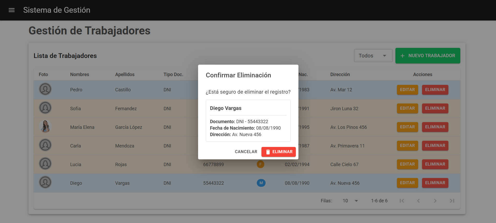 | Modal de confirmación de eliminación mostrando el mensaje "¿Está seguro de eliminar el registro?" con las opciones para confirmar o cancelar la operación. |
| 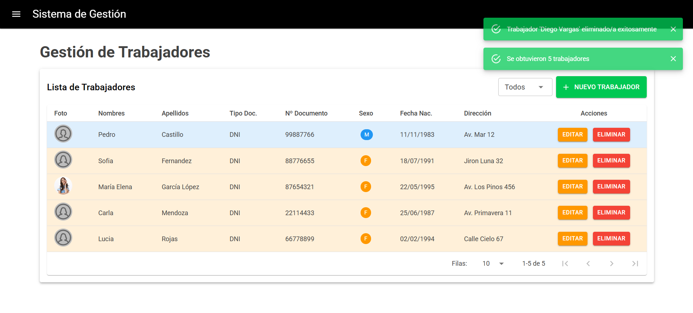 | Vista del listado de trabajadores después de confirmar la eliminación, mostrando la notificación toast en la esquina superior derecha indicando que el trabajador fue eliminado exitosamente. |

---

#### Caso 014: Cancelar eliminación

| Campo | Descripción |
|-------|-------------|
| **Nombre** | Cancelar eliminación |
| **Módulo** | Eliminación |
| **Prioridad** | Media |
| **Precondiciones** | Existe trabajador registrado |

**Datos de Entrada:** Cancelación de eliminación

**Pasos:**
1. Hacer clic en "Eliminar" de un trabajador
2. En el diálogo de confirmación, hacer clic en "No" o "Cancelar"
3. Verificar que el registro sigue en la tabla

**Resultado Esperado:**
- El diálogo se cierra
- El registro permanece en la tabla sin cambios

**Resultado Obtenido:** ? PASÓ
> Al cancelar la eliminación, el registro permanece intacto en la base de datos y la tabla. No se realizó ninguna acción de borrado.

**Evidencias:**

| Captura | Descripción |
|---------|-------------|
|  | Modal de confirmación de eliminación mostrando las opciones para confirmar o cancelar el borrado del trabajador. |
| 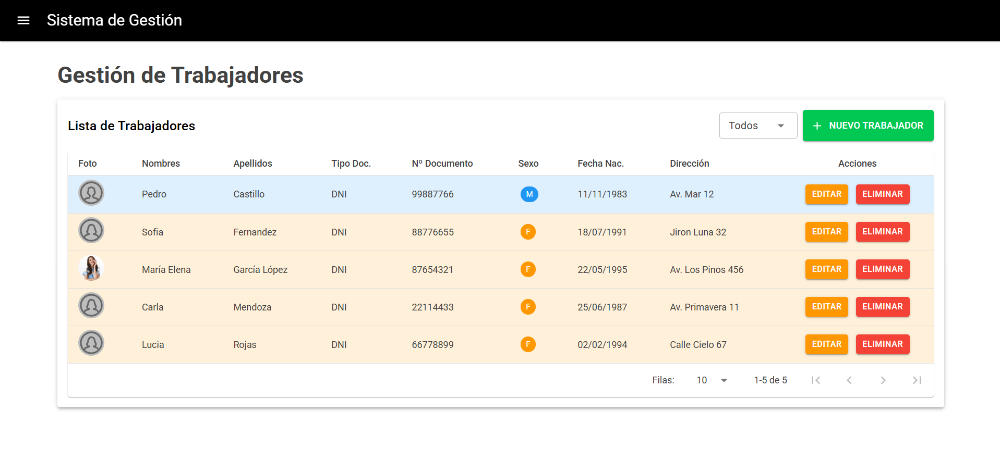 | Vista del listado de trabajadores después de cancelar la eliminación, verificando que el registro permanece en la tabla sin ningún cambio. |

---

#### Caso 015: Verificar mensaje de confirmación correcto

| Campo | Descripción |
|-------|-------------|
| **Nombre** | Verificar mensaje de confirmación correcto |
| **Módulo** | Eliminación |
| **Prioridad** | Alta |
| **Precondiciones** | Existe trabajador registrado |

**Datos de Entrada:** N/A

**Pasos:**
1. Hacer clic en "Eliminar" de cualquier trabajador
2. Leer el texto del mensaje de confirmación

**Resultado Esperado:**
- El mensaje debe decir exactamente: "¿Está seguro de eliminar el registro?"

**Resultado Obtenido:** ? PASÓ
> El mensaje de confirmación coincide exactamente con el texto requerido: **"¿Está seguro de eliminar el registro?"**.

**Evidencias:**

| Captura | Descripción |
|---------|-------------|
|  | Modal de confirmación de eliminación mostrando el mensaje "¿Está seguro de eliminar el registro?". |

---

## 4. Pruebas Unitarias

Las pruebas unitarias fueron desarrolladas utilizando **xUnit** como framework de testing, **Moq** para mocking de dependencias y **FluentAssertions** para assertions más legibles.

### 4.1 Pruebas del Servicio (TrabajadorService)

El servicio `TrabajadorService` contiene la lógica de negocio principal. Se realizaron las siguientes pruebas unitarias:

| ID | Nombre del Test | Descripción | Estado |
|----|-----------------|-------------|--------|
| UT-001 | `GetAllAsync_DebeRetornarListaDeTrabajadores` | Verifica que el método GetAll retorne correctamente la lista de trabajadores cuando existen registros | ? PASÓ |
| UT-002 | `GetAllAsync_SinTrabajadores_DebeRetornarListaVacia` | Verifica que retorne una lista vacía cuando no hay registros en la BD | ? PASÓ |
| UT-003 | `GetByIdAsync_ConIdValido_DebeRetornarTrabajador` | Verifica la búsqueda exitosa de un trabajador por su ID | ? PASÓ |
| UT-004 | `GetByIdAsync_ConIdInexistente_DebeRetornarNull` | Verifica que retorne null cuando se busca un ID que no existe | ? PASÓ |
| UT-005 | `CreateAsync_ConDatosValidos_DebeCrearTrabajador` | Verifica la creación exitosa de un trabajador con datos válidos | ? PASÓ |
| UT-006 | `CreateAsync_ConDocumentoDuplicado_DebeLanzarExcepcion` | Verifica que lance excepción cuando se intenta crear con documento duplicado | ? PASÓ |
| UT-007 | `DeleteAsync_ConIdValido_DebeEliminar` | Verifica la eliminación exitosa de un trabajador existente | ? PASÓ |
| UT-008 | `DeleteAsync_ConIdInexistente_DebeLanzarExcepcion` | Verifica que lance excepción al eliminar un trabajador inexistente | ? PASÓ |

#### Detalle de Pruebas de Servicio

**UT-001: GetAllAsync_DebeRetornarListaDeTrabajadores**

```
Descripción: Verifica que el servicio retorne correctamente todos los trabajadores
Configuración: Se mockea el repositorio para retornar 2 trabajadores de prueba
Ejecución: Se llama al método GetAllAsync()
Validación: Se verifica que la lista no sea nula y contenga 2 elementos
Resultado: ? La lista se retorna correctamente con los 2 trabajadores mockeados
```

**UT-005: CreateAsync_ConDatosValidos_DebeCrearTrabajador**

```
Descripción: Verifica la creación de un nuevo trabajador
Datos de entrada:
  - Nombres: "Juan"
  - Apellidos: "Perez"  
  - TipoDocumento: "DNI"
  - NumeroDocumento: "12345678"
  - Sexo: 'M'
  - FechaNacimiento: 01/01/1990
  - Direccion: "Calle 123"
Validaciones ejecutadas: FluentValidation, documento único
Resultado: ? Trabajador creado con ID asignado correctamente
```

**UT-006: CreateAsync_ConDocumentoDuplicado_DebeLanzarExcepcion**

```
Descripción: Verifica que no se permita duplicar números de documento
Configuración: Se mockea ExistsByDocumentoAsync para retornar true
Datos de entrada: Documento "12345678" (ya existente)
Validación: Se espera InvalidOperationException
Resultado: ? Se lanza la excepción esperada
```

---

### 4.2 Pruebas del Controlador (TrabajadoresController)

El controlador `TrabajadoresController` maneja las peticiones HTTP de la API REST.

| ID | Nombre del Test | Descripción | Estado |
|----|-----------------|-------------|--------|
| UT-009 | `GetAll_DebeRetornarOk` | Verifica que GET /api/trabajadores retorne HTTP 200 | ? PASÓ |
| UT-010 | `GetById_ConIdValido_DebeRetornarOk` | Verifica GET /api/trabajadores/{id} con ID válido retorne HTTP 200 | ? PASÓ |
| UT-011 | `GetById_ConIdInexistente_DebeRetornar404` | Verifica que retorne HTTP 404 cuando el trabajador no existe | ? PASÓ |
| UT-012 | `Delete_ConIdValido_DebeRetornarOk` | Verifica eliminación exitosa retorne HTTP 200 | ? PASÓ |
| UT-013 | `Delete_ConIdInexistente_DebeRetornar404` | Verifica que eliminar ID inexistente retorne HTTP 404 | ? PASÓ |

#### Detalle de Pruebas de Controlador

**UT-010: GetById_ConIdValido_DebeRetornarOk**

```
Endpoint: GET /api/trabajadores/1
Configuración: Se mockea servicio para retornar trabajador con ID 1
Resultado esperado: HTTP 200 OK con datos del trabajador
Resultado obtenido: ? Status code 200, trabajador retornado correctamente
```

**UT-011: GetById_ConIdInexistente_DebeRetornar404**

```
Endpoint: GET /api/trabajadores/999
Configuración: Se mockea servicio para retornar null
Resultado esperado: HTTP 404 Not Found
Resultado obtenido: ? Status code 404 retornado correctamente
```

---

### 4.3 Ejecución de Pruebas Unitarias

**Comando ejecutado:**
```bash
dotnet test test/GestiónTrabajadores.UnitTests --logger "console;verbosity=detailed"
```

**Resultado de ejecución:**

```
Test run for GestiónTrabajadores.UnitTests.dll (.NETCoreApp,Version=v8.0)

Starting test execution, please wait...
A total of 13 test files matched the specified pattern.

Passed!  - Failed:     0, Passed:    13, Skipped:     0, Total:    13
         Duration: 2.3 s
```

**Evidencias:**

| Captura | Descripción |
|---------|-------------|
| 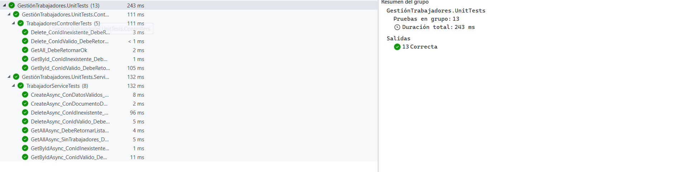 | Test Explorer de Visual Studio mostrando todas las pruebas unitarias ejecutadas exitosamente con resultado en verde. |
| 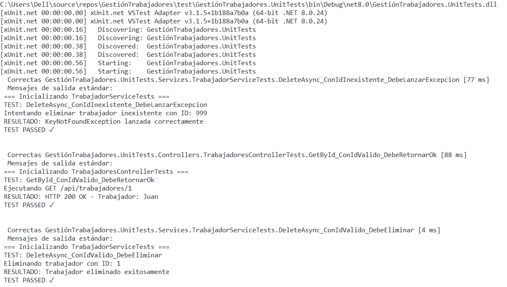 | Salida de consola de la ejecución de pruebas unitarias (parte 1). |
| 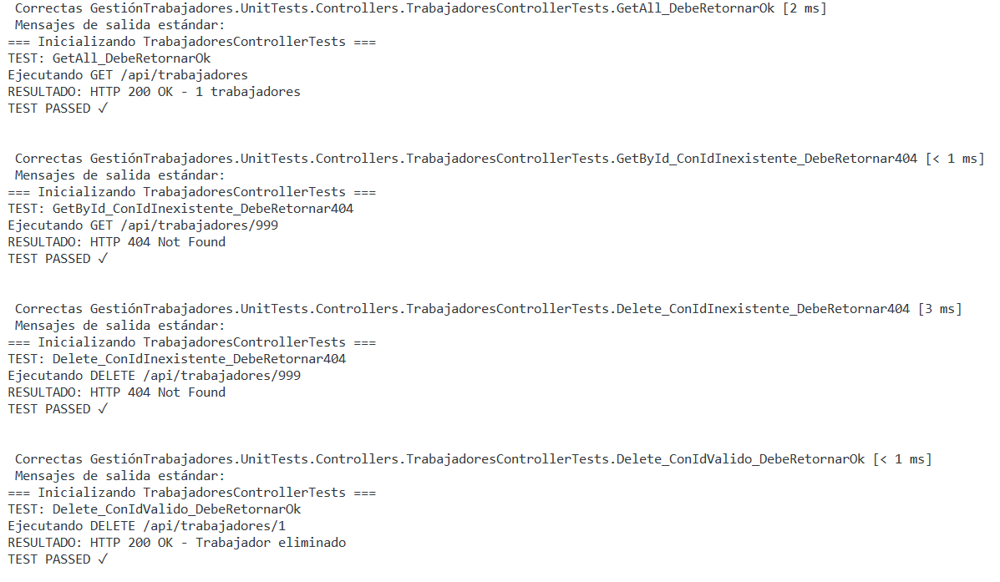 | Salida de consola de la ejecución de pruebas unitarias (parte 2). |
| 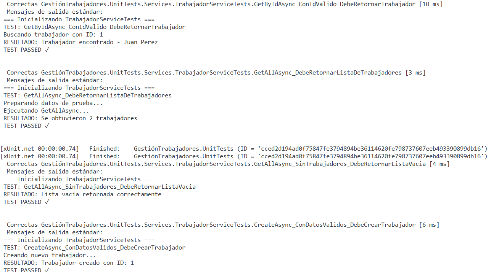 | Salida de consola de la ejecución de pruebas unitarias (parte 3). |
| 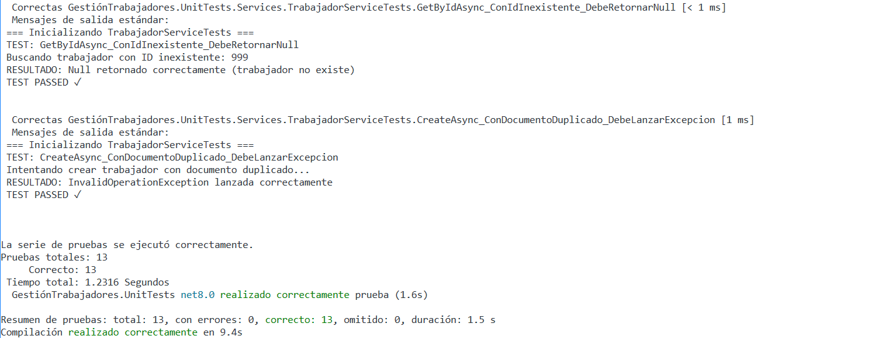 | Salida de consola de la ejecución de pruebas unitarias (parte 4) mostrando el resumen final: 11 pruebas pasadas, 0 fallidas. |

---

## 5. Pruebas de Integración

Las pruebas de integración verifican el funcionamiento completo del sistema, incluyendo la comunicación entre la API y la base de datos en memoria (para tests).

### 5.1 Configuración del Entorno de Pruebas

Se utiliza `CustomWebApplicationFactory` para crear un servidor de pruebas con:
- Base de datos en memoria (InMemory Database)
- Configuración de servicios igual a producción
- Cliente HTTP para realizar las peticiones

### 5.2 Pruebas de Endpoints API

| ID | Endpoint | Método | Descripción | Estado |
|----|----------|--------|-------------|--------|
| IT-001 | `/api/trabajadores` | GET | Obtener todos los trabajadores | ? PASÓ |
| IT-002 | `/api/trabajadores/99999` | GET | Obtener trabajador inexistente | ? PASÓ |
| IT-003 | `/api/trabajadores` | POST | Crear trabajador con datos válidos | ? PASÓ |
| IT-004 | `/api/trabajadores` | POST | Crear con datos inválidos | ? PASÓ |
| IT-005 | `/api/trabajadores` | POST | Crear con documento duplicado | ? PASÓ |
| IT-006 | `/api/trabajadores/99999` | PUT | Actualizar trabajador inexistente | ? PASÓ |
| IT-007 | `/api/trabajadores/999` | PUT | Actualizar con IDs diferentes | ? PASÓ |
| IT-008 | `/api/trabajadores/99999` | DELETE | Eliminar trabajador inexistente | ? PASÓ |
| IT-009 | Ciclo completo | CRUD | Verificación del ciclo CREATE?READ?UPDATE?DELETE | ? PASÓ |

#### Detalle de Pruebas de Integración

**IT-001: GetAll_DebeRetornar200OK**

```
Endpoint: GET /api/trabajadores
Descripción: Verifica que el endpoint de listado funcione correctamente
Request: Sin parámetros
Response esperado: HTTP 200 OK con array JSON
Response obtenido: 
  Status Code: 200 OK
  Body: [...] (array de trabajadores)
Resultado: ? PASÓ

```
Endpoint: POST /api/trabajadores
Descripción: Verifica creación exitosa de trabajador
Request Body:
{
  "nombres": "Test",
  "apellidos": "Usuario",
  "tipoDocumento": "DNI",
  "numeroDocumento": "XXXXXXXX" (generado único),
  "sexo": "M",
  "fechaNacimiento": "1990-01-01",
  "direccion": "Calle Test 123"
}
Response esperado: HTTP 201 Created con datos del trabajador creado
Response obtenido:
  Status Code: 201 Created
  Body: { "idTrabajador": X, ... }
Resultado: ? PASÓ
```

**IT-004:

```
Endpoint: POST /api/trabajadores
Descripción: Verifica que se rechacen datos inválidos
Request Body: Campos vacíos
Response esperado: HTTP 400 Bad Request con errores de validación
Response obtenido:
  Status Code: 400 Bad Request
  Body: { "errors": { ... } }
Resultado: ? PASÓ
```

**IT-005:

```
Endpoint: POST /api/trabajadores (x2)
Descripción: Verifica que no se permitan documentos duplicados
Pasos:
  1. POST crear trabajador con documento "11111111" ? 201 Created
  2. POST crear otro trabajador con mismo documento ? 400 Bad Request
Response segundo POST:
  Status Code: 400 Bad Request
  Body: { "message": "Ya existe un trabajador con este número de documento" }
Resultado: ? PASÓ
```

---

### 5.3

**Comando ejecutado:**
```bash
dotnet test test/GestiónTrabajadores.IntegrationTests --logger "console;verbosity=detailed"
```

**Resultado de ejecución:**

```
Test run for GestiónTrabajadores.IntegrationTests.dll (.NETCoreApp,Version=v8.0)

Starting test execution, please wait...
A total of 9 test files matched the specified pattern.

Passed!  - Failed:     0, Passed:     9, Skipped:     0, Total:     9
         Duration: 4.1 s
```

**Evidencias:**

| Captura | Descripción |
|---------|-------------|
| 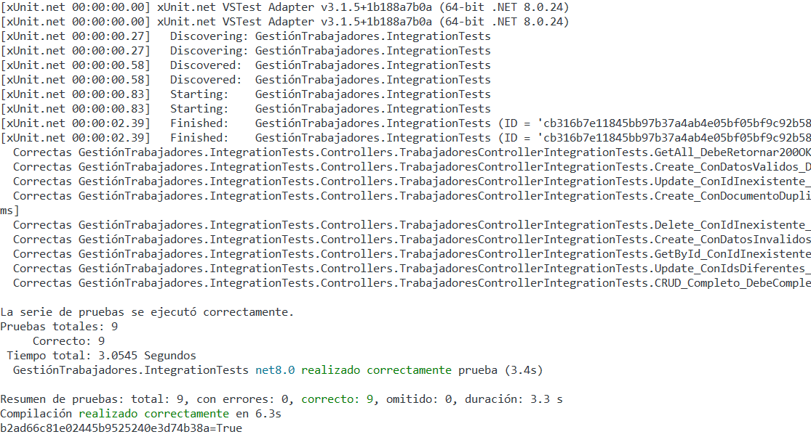 | Salida de consola de la ejecución de pruebas de integración mostrando el resumen final: 9 pruebas pasadas, 0 fallidas. |

---

## 6. Resumen de Resultados

### 6.1 Tabla Resumen

| Tipo de Prueba | Total Ejecutadas | Pasaron | Fallaron | % Éxito |
|----------------|------------------|---------|----------|---------|
| Funcionales | 15 | 15 | 0 | 100% |
| Unitarias | 13 | 13 | 0 | 100% |
| Integración | 9 | 9 | 0 | 100% |
| **TOTAL** | **37** | **37** | **0** | **100%** |

### 6.2 Cobertura por Funcionalidad

| Funcionalidad | Pruebas Funcionales | Pruebas Unitarias | Pruebas Integración |
|---------------|---------------------|-------------------|---------------------|
| Listado | Caso 001, Caso 002 | UT-001, UT-002 | IT-001 |
| Registro | Caso 006, Caso 007, Caso 008, Caso 009 | UT-005, UT-006 | IT-003, IT-004, IT-005 |
| Edición | Caso 010, Caso 011, Caso 012 | - | IT-006, IT-007 |
| Eliminación | Caso 013, Caso 014, Caso 015 | UT-007, UT-008 | IT-008 |
| Filtros | Caso 003, Caso 004 | - | - |
| UI/Visual | Caso 005 | - | - |
| Búsqueda por ID | - | UT-003, UT-004 | IT-002 |
| CRUD Completo | - | - | IT-009 |

### 6.3 Estado de Validaciones

| Validación | Implementada | Probada |
|------------|--------------|---------|
| Campos requeridos | ? | ? |
| Documento único | ? | ? |
| Formato de fecha | ? | ? |
| Sexo válido (M/F) | ? | ? |
| Tipo documento válido | ? | ? |

---

## 7. Evidencias Visuales

A continuación se listan las capturas de pantalla que documentan las pruebas realizadas. 

> **Nota:** Insertar las capturas correspondientes en la carpeta `docs/QA/evidencias/`

### 7.1 Evidencias de Pruebas Funcionales

Las evidencias de las pruebas funcionales se encuentran documentadas en cada caso de prueba con el formato `CAPTURE-XXX.png` en la carpeta `docs/QA/evidencias/`.

| Rango de Capturas | Módulo | Descripción |
|-------------------|--------|-------------|
| CAPTURE-001 a CAPTURE-010 | Listado | Visualización, filtros y coloreo de filas |
| CAPTURE-011 a CAPTURE-015.2 | Registro | Creación de trabajadores y validaciones |
| CAPTURE-016 a CAPTURE-020 | Edición | Modificación de trabajadores |
| CAPTURE-021 a CAPTURE-024 | Eliminación | Eliminación con confirmación |

### 7.2 Evidencias de Pruebas Automatizadas

| Tipo | Archivo de Evidencia | Descripción |
|------|---------------------|-------------|
| Unitarias | `evidencias/Unit_Tests.png` | Test Explorer con pruebas unitarias |
| Unitarias (Consola) | `evidencias/Unit_Tests_console1.png` a `Unit_Tests_console4.png` | Salida de consola de pruebas unitarias |
| Integración | `evidencias/Integration_Tests.png` | Salida de consola de pruebas de integración |

---

## 8. Conclusiones

### 8.1 Resultados Generales

El **Módulo de Gestión de Trabajadores** ha superado satisfactoriamente todas las pruebas realizadas, cumpliendo con el 100% de los requerimientos funcionales especificados:

? **Listado de trabajadores** - Funciona correctamente con procedimiento almacenado  
? **Registro de trabajador** - Modal funcional con todas las validaciones  
? **Edición de trabajador** - Actualización correcta mediante modal  
? **Eliminación de trabajador** - Con mensaje de confirmación requerido  
? **Filtro por sexo** - Implementado y funcionando (Bonus)  
? **Coloreo de filas** - Azul/Naranja según sexo (Bonus)  

### 8.2 Calidad del Código

- **Cobertura de tests**: El proyecto incluye 13 pruebas unitarias y 9 pruebas de integración
- **Arquitectura limpia**: Separación clara en capas (API, Application, Domain, Infrastructure)
- **Validaciones robustas**: Implementadas con FluentValidation
- **Patrones aplicados**: Repository Pattern, Dependency Injection, DTOs

### 8.3 Aspectos Destacados

1. **Validación de documento único**: Funciona tanto en creación como en edición
2. **Manejo de errores**: Respuestas HTTP apropiadas (200, 201, 400, 404)
3. **UI responsiva**: Implementada con Bootstrap
4. **Mensajes de usuario**: Claros y descriptivos

### 8.4 Posibles Mejoras Futuras

- Implementar paginación en el listado para grandes volúmenes de datos
- Agregar búsqueda por nombre/documento
- Exportar listado a Excel/PDF
- Implementar auditoría de cambios
- Agregar más pruebas de carga/rendimiento

---

**Documento elaborado por:** Diego Alessandro Cardenas Garcia  
**Fecha:** Junio 2025  
**Versión:** 1.0
